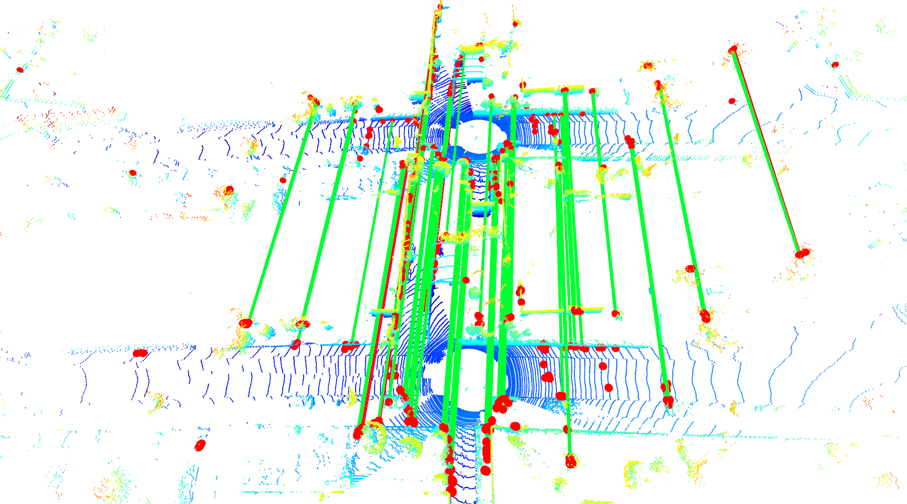
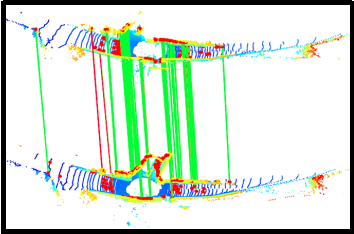
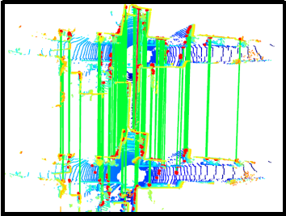
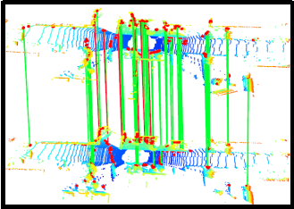
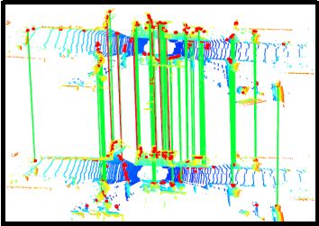

# MDGAT-matcher for 3D point cloud registration

This repo contains the code for our RAL2021 paper, [**Keypoint Matching for Point Cloud Registration Using Multiplex Dynamic Graph Attention Networks**](https://www.researchgate.net/publication/353330868_Keypoint_Matching_for_Point_Cloud_Registration_Using_Multiplex_Dynamic_Graph_Attention_Networks).

In this paper, we propose a novel and flexible graph network architecture to tackle the keypoint matching problem in an end-to-end fashion. This repo includes PyTorch code for training and testing out MDGAT-matcher network on top of [USIP](https://github.com/lijx10/USIP) keypoints and FPFH descriptors.



## Publication

If you use our implementation in your academic work, please cite the corresponding [paper](https://www.researchgate.net/publication/353330868_Keypoint_Matching_for_Point_Cloud_Registration_Using_Multiplex_Dynamic_Graph_Attention_Networks):

```
@ARTICLE{shi2021ral,
  author={Shi, Chenghao and Chen, Xieyuanli and Huang, Kaihong and Xiao, Junhao and Lu, Huimin and Stachniss, Cyrill},
  journal={IEEE Robotics and Automation Letters}, 
  title={Keypoint Matching for Point Cloud Registration Using Multiplex Dynamic Graph Attention Networks}, 
  year={2021},
  volume={6},
  number={4},
  pages={8221-8228},
  doi={10.1109/LRA.2021.3097275}}
```

## Dependencies

This repo is implemented under Pytorch. For the Pytorch version

- Pytorch Installation guide: [link](https://pytorch.org/get-started/locally/)

- Python Dependencies (the requirements file provides the version used in our experiments, it may also work with different versions)

  ```
  sudo -H pip3 install -r requirements.txt
  ```

## Training and Test

Our method runs on top of detected keypoints and  initial descriptors. In our experiment, we use USIP keypoionts and FPFH descriptor. Before training and test, one need to pre-extract the features on point cloud and generate the ground truth. One can follow [USIP](https://github.com/lijx10/USIP) to generate your own keypoints and descriptors. 

One can also download the our generated [features](https://www.ipb.uni-bonn.de/html/projects/MDGAT-matcher/MDGAT-matcher.zip) used in our experiments.

For mainland China friends, you may use a faster [link](https://pan.baidu.com/s/1XJ-1YBN6kAiAud9xQg2B4w ), extract code: 08xs.

Put the files in the ./KITTI directory, then you are ready to use our model.

### Train

To train the network with default parameters, run the following command:

```sh
python3 train.py
```

### Test

For quick test, we provide a pre-trained model in ./pre-trained. To reproduce the results of this paper, run the following command:

```sh
python3 test.py
```

We also provide another script 'test_registration_metric.py' following common practice[[1](https://github.com/chrischoy/FCGF),[2](https://github.com/XuyangBai/D3Feat)]. Run the following command:

```sh
python3 test_registration_metric.py
```


## Visualization Demo

The true matches are colored by green, the false match are colored by red, and the keypoints are represented as red dot.

<center class="half">          </center>


<center class="half">           </center>


## License

This project is free software made available under the MIT License. For details see the LICENSE file.


## References

[1] D3Feat: Joint Learning of Dense Detection and Description of 3D Local Features, Xuyang Bai, Zixin Luo, Lei Zhou, Hongbo Fu, Long Quan and Chiew-Lan Tai, CVPR 2020.

[2] Fully Convolutional Geometric Features, Christopher Choy and Jaesik Park and Vladlen Koltun, ICCV 2019.

[3] Superglue: Learning feature matching with graph neural networks, P.E. Sarlin, D. Detone, T. Malisiewicz, and A. Rabinovich, CVPR 2020

[4] Usip: Unsupervised stable interest point detection from 3d point clouds, J.X. Li and G.H. Lee, ICCV 2019